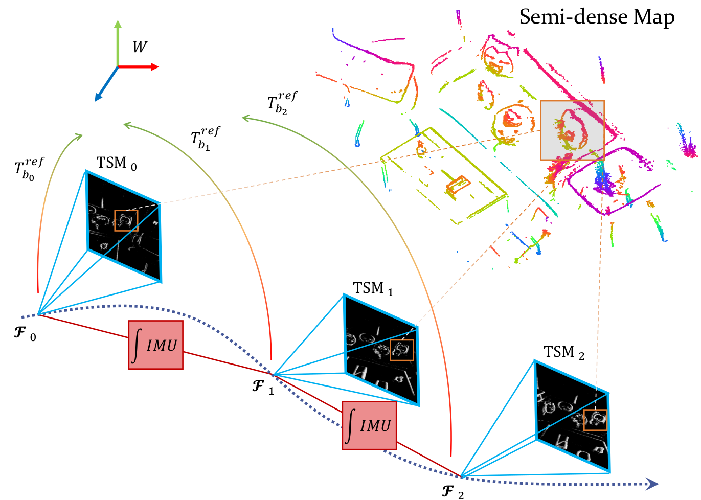

# [IROS'24]EVIT: Event-based Visual-Inertial Tracking in Semi-Dense Maps Using Windowed Nonlinear Optimization


This repo is the implementation of our IROS'24 contribution 

[**EVIT: Event-based Visual-Inertial Tracking in Semi-Dense Maps Using Windowed Nonlinear Optimization**](https://arxiv.org/abs/2408.01370).

**This repo is also capable of performing the pure Event Vision Tracking without IMU information mentioned in previous [Semi-Dense Tracking Work](https://ieeexplore.ieee.org/abstract/document/10401990), but we have not make it an individual node. You could also comment the IMU related code to achieve this functionality. We would do it ASAP.**

<p align="center"> 

</p>

    @article{yuan2024evit,
        title={EVIT: Event-based Visual-Inertial Tracking in Semi-Dense Maps Using Windowed Nonlinear Optimization},
        author={Yuan, Runze and Liu, Tao and Dai, Zijia and Zuo, Yi-Fan and Kneip, Laurent},
        journal={arXiv preprint arXiv:2408.01370},
        year={2024}
    }
**Video:**

https://github.com/user-attachments/assets/1efee3f4-3133-417a-866c-e1877b50590c

## 1. Prerequisites
The code is tested on Ubuntu 20.04 with ROS noetic using cpp standard 17.

### 1.1 Eigen

[Eigen](https://eigen.tuxfamily.org/index.php?title=Main_Page) with version 3.4 shoule work. An older version may also be Ok.

If you encounter the compile problem 
```
error: ‘Vector’ in namespace ‘Eigen’ does not name a template type; did you mean ‘VectorXd’?
```
then it is most likely your Eigen version problem.

### 1.2 Ceres Solver

Follow the [Ceres Solver Installation Guide](http://ceres-solver.org/installation.html) to install the solver library. 

Ceres solver with version 2.2.0 is tested fine.

### 1.3 OpenCV

[OpenCV](https://opencv.org/) 4 is required. (The default opencv dependency when installing ROS would be enough)

If you are using OpenCV 3, we provide some checks to avoid the compile issue, but it is not guarantee to work.

### 1.4 Pangolin

Follow the [Installation Guide](https://github.com/stevenlovegrove/Pangolin) to install Pangolin.


## 2. Compile

Ubuntu:

In the terminal, just type the command below in the project folder

```sh
source build_all.zsh
```
If you are using a different shell, just change the script into the corresponding format.  

Note, the compilation is in two part.

1. The **EVIT** library, which is the **libEVIT.so**file in **lib** folder. It consists of the core algorithm and visualization using pangoling. This part is not related to ROS, so you can compile the library without ROS and use the API it provides.
2. The **Demo** runing on [VECtor](https://star-datasets.github.io/vector/) small scale dataset. This part relates to ROS.

You can always compile these two parts individually. Refer to the compile script. 


## 3. Usage
We mainly use [VECtor](https://star-datasets.github.io/vector/) dataset for testing and demonstration. You may want to follow the instruction in [MPL dataset toolbox](https://github.com/mgaoling/mpl_dataset_toolbox#bag-merger) to merge the pieces into one bag.

We provide some pre-built semi-dense point cloud, repectively. They are listed under the folder **cloud**.

Modify the config files under the folder **example/ROS/src/evit_demo/config** to make sure you have the right _cloud_path_ and _result_path_ parameter. (Maybe you should create the result path folder first)

If you want to change the ros topic name of events or IMU messages, just modify the launch files in ROS workspace.

If you did things above correctly, you should be able to run (for example)
```sh
roslaunch evit_demo robot_fast.launch
```
then play the corresponding bag
```sh
rosbag play robot_fast.bag
```

You may want to press space several times to finish the initialization phase.

We also provide some simple examples without ROS dependency and several scripts maybe useful.

## 4. Acknowledgements

The code of IMU pre-integration part is borrowed from [VINS-MONO](https://github.com/HKUST-Aerial-Robotics/VINS-Mono?tab=readme-ov-file).

## 5. Author
Contact: Runze Yuan (yuanrz@shanghaitech.edu.cn)


